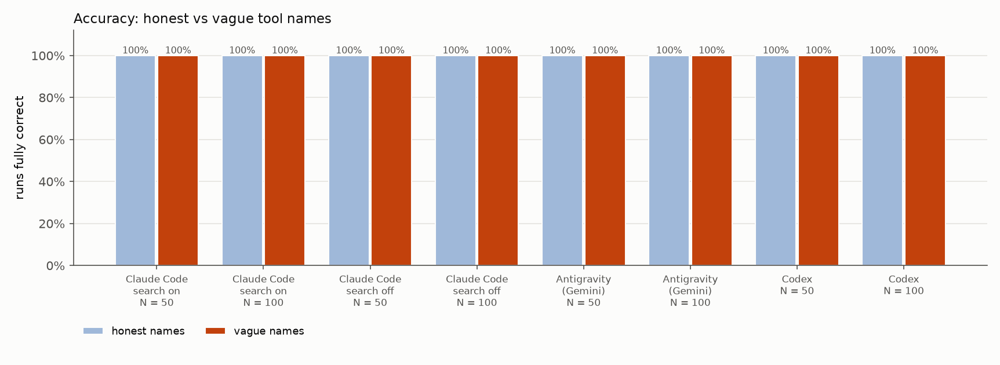
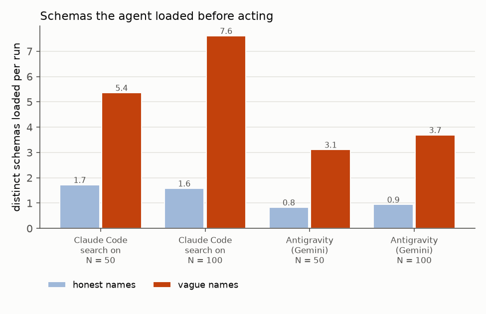

Every run above used honest, distinct names (`pdf_compress` next to `pdf_optimize` and `image_compress`). In two of the four harnesses the model sees **only the names** before it chooses what to load: Claude Code with tool search on (the default) and Antigravity. So did the names do the work? This variant keeps everything else fixed and makes the names bad.

**Setup (2026-10-08).**
- `TC_NAMES=vague` exposes the same 100 tools, with the same descriptions, schemas, exposure order, tasks and scoring, under the names in [`vague-names.json`](vague-names.json). The server maps every call back to the honest operation, so scoring still works on the canonical op.
- **How the names were made:**
  - They are generic verbs and nouns of the kind a careless real server ships: `optimize_file`, `process_image`, `convert_document`, `handle_archive`, `edit_pages`, `run_pdf_job`, `image_utils`, `file_action`.
  - A name never says the exact operation, and never says the format pair. "document" and "file" are used for PDFs, Word files and everything else alike. Some names keep a coarse noun (`image`, `pages`, `data`, `archive`), as real ones do.
  - **Look-alike operations get look-alike names:**
    - `pdf_compress` / `pdf_optimize` / `image_compress` / `image_optimize_web` → `optimize_file` / `optimize_document` / `process_image` / `optimize_image`
    - `pdf_protect` / `pdf_unlock` / `zip_protect` → `secure_file` / `secure_document` / `secure_archive`
    - `pdf_delete_pages` / `pdf_split` / `pdf_reorder_pages` / `pdf_extract_pages` / `pdf_crop` → `edit_pages` / `handle_pages` / `manage_pages` / `page_tools` / `adjust_pages`
    - `doc_to_pdf` / `pptx_to_pdf` / `pdf_to_docx` → `convert_document` / `convert_file` / `convert_pdf`
    - `pdf_from_images` / `pdf_merge` / `image_collage` → `build_document` / `combine_files` / `build_image`
    - `ocr_image` / `qr_read` / `pdf_extract_text` → `read_image` / `scan_image` / `read_document`
    - `pdf_metadata_set` / `image_strip_metadata` / `pdf_redact` → `update_document` / `update_image` / `sanitize_document`
  - The names are unique, valid MCP names (`^[a-zA-Z0-9_-]{1,64}$`), plausible (no `tool_7`), and none of them is one of the honest names.
- **Compatibility:** without `TC_NAMES`, the server sends the same bytes as before. `verify_compat.py` checks the exact `initialize` + `tools/list` bytes for all 234 task × size exposures (5–100 and GROUPED) against hashes recorded before the change. It also checks that the vague exposure differs only in names. All earlier runs were re-scored with the extended `score.py`, and every previously reported column came out identical.
- **Runs:** N = 50 and 100 × 18 tasks × 2 repetitions, in three lanes:
  - `claude-search` (tool search on, the default: names only, schemas loaded with `ToolSearch`);
  - `claude` (tool search off: every description and schema is in the prompt). This is the control: can descriptions rescue vague names?
  - `gemini` (Antigravity: names in the prompt, schema files read on demand).
  That is 216 runs, all scored, with 0 built-in tool calls. Gemini never opened a file outside the schema cache, including the `vague-names.json` that sits next to the server. Codex was added last as an optional lane. It hit its ChatGPT Plus usage limit ("try again at 3:25 AM") after 60 of 72 runs (30 at each N), and the lane was stopped there. The Codex numbers below cover those 60 runs.

**Accuracy did not move. 276 of 276 vague-name runs were fully correct** (Claude search on 72/72, Claude search off 72/72, Gemini 72/72, Codex 60/60). No wrong tool was executed in any run. In every harness, the final choice came from the description, not the name.

**What the names did decide is how much the agent had to read before it acted:**

| lane | N | names | fully correct | schemas loaded/run | extra (not needed) schemas/run | runs whose first load was wrong | input tok/run | wall s |
|---|---|---|---|---|---|---|---|---|
| Claude, search on | 50 | honest | 36/36 | 1.72 | 0.06 | 0 | 17.4k | 11.0 |
| Claude, search on | 50 | vague | 36/36 | 5.36 | 3.81 | 3 | 19.9k | 9.9 |
| Claude, search on | 100 | honest | 36/36 | 1.58 | 0.03 | 0 | 19.9k | 9.4 |
| Claude, search on | 100 | vague | 36/36 | 7.61 | 6.00 | 5 | 24.1k | 8.6 |
| Claude, search off | 50 | honest | 36/36 | all | – | – | 27.9k | 6.2 |
| Claude, search off | 50 | vague | 36/36 | all | – | – | 28.0k | 7.9 |
| Claude, search off | 100 | honest | 36/36 | all | – | – | 48.6k | 6.7 |
| Claude, search off | 100 | vague | 36/36 | all | – | – | 47.5k | 8.4 |
| Gemini | 50 | honest | 36/36 | 0.83 | 0.00 | 0 | 20.5k | 23.0 |
| Gemini | 50 | vague | 36/36 | 3.11 | 1.78 | 15 | 19.4k | 24.4 |
| Gemini | 100 | honest | 36/36 | 0.94 | 0.06 | 0 | 18.6k | 19.9 |
| Gemini | 100 | vague | 36/36 | 3.69 | 2.33 | 19 | 25.7k | 28.5 |
| Codex | 50 | honest | 36/36 | (code search) | – | – | 61.4k | 14.2 |
| Codex | 50 | vague | 30/30 | (code search) | – | – | 60.2k | 14.8 |
| Codex | 100 | honest | 36/36 | (code search) | – | – | 78.2k | 13.8 |
| Codex | 100 | vague | 30/30 | (code search) | – | – | 73.2k | 13.3 |

"Schemas loaded" means: for Claude, the distinct tools returned by its `ToolSearch` calls; for Gemini, the schema files it opened. "First load wrong" means the first search, or the first schema file opened, contained no tool the task needed.

- **Claude Code, tool search on (default).**
  - With honest names it picked from the name list and loaded exactly the needed schema by exact name (`select:`) in 69 of 72 runs. It never ran a keyword search.
  - With vague names that worked in only 7 of 72 runs. In the other runs it did one of two things. It loaded a handful of plausible candidates by name, e.g. `select:optimize_file,process_image,transform_image,update_image,inspect_image` for "shrink logo.png". Or it fell back to a **keyword search**, which matches descriptions, e.g. `linearize pdf fast web view`, `ocr text from image`, `remove delete pages pdf`. Keyword searches happened in 15 of 36 runs at 50 tools and 28 of 36 at 100.
  - Schemas loaded per run went from 1.7 to 5.4 at 50 tools and from 1.6 to 7.6 at 100. Up to 23 tools came back in one run (t08, "3 JPGs into one PDF").
  - The first search missed the needed tool in 8 runs: `combine_files` (= `pdf_merge`) for t08 four times, `optimize_image` / `convert_image` for t07 three times, `handle_pdf` (= `pdf_sign`) for t18 once. Every one of those runs then searched again and found the right tool.
  - Cost: per-run input +14% at 50 and +21% at 100 (24.1k vs 19.9k), list price $0.056 vs $0.047 at 100 (+19%), and 0.2–0.3 more model calls per run. Wall time did not grow (8.6 vs 9.4 s at 100).
- **Claude Code, tool search off (the control).** All descriptions are in the prompt, so vague names changed nothing measurable: 100%, the same tokens (vague names are slightly shorter: 20.0k vs 20.2k on the first call at 100), the same number of calls. So yes, the descriptions rescue vague names. With tool search on, the rescue costs the reads above.
- **Antigravity (Gemini).**
  - With honest names Gemini often skipped the schema read and guessed the arguments (10 of 36 runs at 50, 7 of 36 at 100). With vague names it almost always read schemas (it skipped in 1 of 72 runs), and it read several: 3.1–3.7 per run instead of 0.8–0.9, up to 15 in one run.
  - Its first schema read was a wrong tool in 34 of 72 runs. Most often: `optimize_document` (= `pdf_optimize`) for "compress for email", `combine_files` (= `pdf_merge`) for images → PDF, `convert_document` (= `doc_to_pdf`) for pptx → PDF, `sanitize_document` (= `pdf_redact`) for "clear author and title", `edit_image` (= `remove_background`) for "resize".
  - In 10 runs it went further and **called a wrong tool with empty arguments (`{}`) to see what it does**: 16 such probes. Examples: `edit_pages`' neighbours `handle_pages` / `manage_pages` / `adjust_pages` for "remove pages 2 and 5", `combine_files` and `pack_files` (= `zip_create`) for images → PDF, `convert_file` (= `pptx_to_pdf`) for docx → PDF and xlsx → CSV, `run_pdf_job` (= `pdf_flatten`) while merging. Every probe was rejected for missing required arguments, so nothing wrong executed. On a real server, the same probe would *run* any tool that has no required arguments.
  - Cost: at 100 tools, +38% input per run (25.7k vs 18.6k), 2× the output (1.6k vs 0.8k tokens, mostly reasoning about which tool is which), and 43% more wall time (28.5 vs 19.9 s). At 50 tools it was a wash (19.4k vs 20.5k), because the honest-name baseline already paid for its own failed argument guesses.
- **Codex** searches the tool definitions with code (a regex over `ALL_TOOLS`, which includes descriptions), so names barely mattered. It was 100% correct, with the same or slightly fewer tokens. At 100 tools its broad first search was still truncated by the exec output cap (31 of 31 runs).

**Most common confusions** (vague name picked or loaded first instead of the needed one): images → PDF read as "combine files" (`combine_files` = `pdf_merge`; 8 first loads and 1 probe, plus 1 probe of `pack_files` = `zip_create`); "shrink a PNG" read as `optimize_image` (= `image_optimize_web`; 4 first loads, 1 probe); "compress for email" read as `optimize_document` (= `pdf_optimize`; 4 first loads, 2 probes); delete pages read as other page tools (3 probes in one run); pptx → PDF and docx → PDF swapped between `convert_file` and `convert_document` (4 first loads, 2 probes). The full list per task is in `tables-vague.md`.

**So do names decide?** Not the final choice, at least not here: four harnesses and 276 runs got every task right with names that do not say which object or which operation. The descriptions decided it. But under deferred loading the name is the only thing the model sees up front, so a vague name costs reads instead of accuracy:
- 3–5× as many schemas loaded;
- a keyword search in most Claude runs at 100 tools;
- wrong first loads in 8 of 72 Claude runs and 34 of 72 Gemini runs;
- empty-argument probes of wrong tools in Gemini;
- +21% (Claude Code, default) and +38% (Antigravity) input per run at 100 tools.
Where every schema is in the prompt anyway (Claude Code with tool search off), names changed nothing. This holds with good descriptions. Vague names *and* vague descriptions, which real servers also ship, were not tested.
