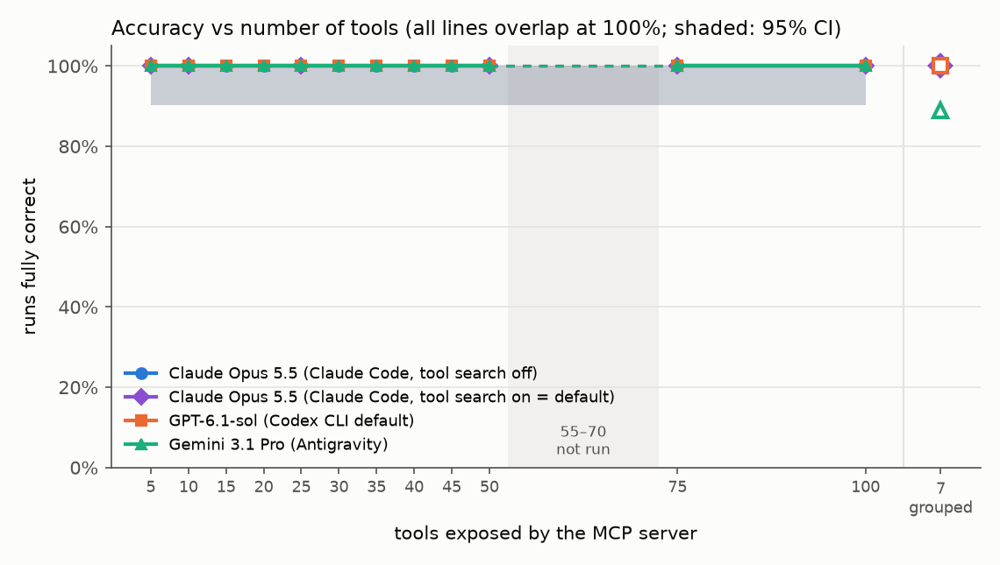
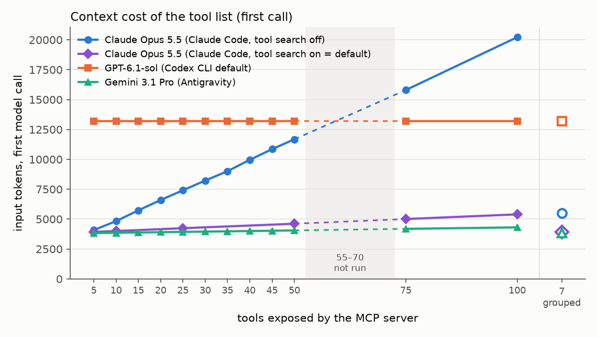
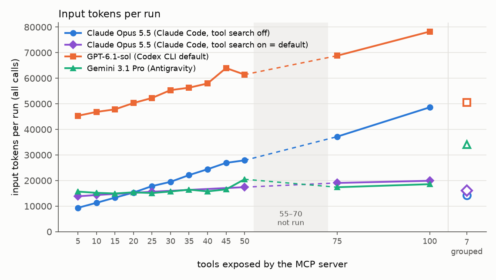

# Does the number of MCP tools hurt an agent? Measured from 5 to 100 tools

Date: 2026-10-07, with a follow-up run on 2026-10-08. This experiment ran 3 agents on 1 fake MCP server exposing 5, 10, …, 50 tools, then 75 and 100, plus a grouped variant: 18 tasks × 2 repetitions per cell, 1,404 scored runs. Sizes 55–70 were not run. The 75/100 extension was added after nothing broke at 50.

**Follow-up (2026-10-08): Claude Code was measured in two modes.** The original Claude Code runs used `--tools ""`, which removes every built-in tool, including `ToolSearch`. Without `ToolSearch`, Claude Code cannot defer MCP tools, so it put every schema into the prompt. That is a real configuration (the same happens with `ENABLE_TOOL_SEARCH=false`, or behind a proxy that does not support tool references), but it is **not Claude Code's default**: by default MCP tools are deferred and loaded through `ToolSearch` ([docs: "Scale with MCP tool search"](https://code.claude.com/docs/en/mcp.md)). A fourth lane, `claude-search`, repeats the Claude runs with `--tools "ToolSearch"` (everything else identical) at N = 5, 10, 25, 50, 75, 100 and GROUPED: 252 more runs, 1,656 in total. Below, "Claude Code, tool search off" is the original lane and "tool search on (default)" is the new one.

## Why

Ashton's dev.to post ("Tool count is context cost: why my MCP server exposes 6 tools instead of 26") argues that 6 grouped tools beat 26 one-per-operation tools. But his measurement compared "server vs no tools at all", not tool counts. "Fewer tools is better" is repeated everywhere, but nobody shows where it breaks. Here we sweep the tool count on a single fake server, keep the tasks fixed, and measure accuracy, tokens, time and cost.

## Short answer

- **Accuracy did not break anywhere between 5 and 100 separate tools, for any of the three agents.**
  - All 1,080 runs with separate tools were fully correct (Claude 360, Codex 360, Gemini 360). The same held at 75 and 100 tools: 216 of 216 runs were fully correct. Fully correct means: right tools, right order for chains, right key arguments, and no wrong tool executed. That holds even for the 10 ambiguous tasks, where a tempting neighbour tool was present (`pdf_compress` vs `pdf_optimize` vs `image_compress`, `doc_to_pdf` vs `pdf_from_images`, `pdf_metadata_set` vs `image_strip_metadata`, and so on).
  - With 36 runs per cell, the 95% lower bound on accuracy is about 90% per cell. Pooled over all twelve sizes (432 runs per model), it is about 99%.
  - So whatever breaking point exists lies beyond 100 tools, or needs harder or less clearly described tools than ours.
- **The cost of more tools is real, and how big it is depends on the harness, not on the model.**
  - **Claude Code, tool search on (the default):** MCP tools are deferred. Only their names go into the prompt, and the model loads the schemas it needs with `ToolSearch` (here always by exact name, `select:…`). First-call input goes from 3.9k at 5 tools to 4.6k at 50 and 5.4k at 100 (about 15 tokens per tool); per run, 13.8k → 17.4k → 19.9k (1.44× from 5 to 100). The price is one extra model call per run (the search), so at small N it costs *more* than loading everything: 48% more input per run at 5 tools. The lines cross at about 19 tools; at 100 tools tool search saves 73% of the first call and 59% of the per-run input. Accuracy: 252 of 252 runs fully correct. Fewer tokens did not mean a cheaper run here: nearly all input is cache reads, and the search adds a call, output and cache writes, so at list price a run cost $0.047 with search on vs $0.038 off at 100 tools (details in "Claude Code: tool search on vs off").
  - **Claude Code, tool search off** (`--tools ""`, `ENABLE_TOOL_SEARCH=false`, or a proxy without tool-reference support) puts every tool's full schema into the prompt. First-call input grows exactly linearly: **3,182 + 169 tokens per tool** (R² = 1.000), from 4.1k at 5 tools to 11.7k at 50 and 20.2k at 100. Per run (all model calls), the cost is 6,989 + 429 × N tokens (R² = 0.997), from 9.3k at 5 to 27.9k at 50, which is 3.0× as many input tokens for the same answer. At 100 it is 48.6k, or 5.2×. The fit made on 5–50 predicts 75 and 100 within ±0.5% for the first call.
  - **Codex CLI** (code mode) does not put MCP tool schemas into the prompt at all. First-call input is a flat ~13,203 tokens at every N. The model searches `ALL_TOOLS` with a regex from inside its `exec` JS tool, and the matching definitions come back as tool output. So per-run input still grows, by about 408 tokens per tool (R² = 0.96; 45.3k → 61.4k → 78.2k at 100), but from a much higher base. At 100 tools its tool search outgrew the exec output cap (see "What happens at 100").
  - **Antigravity** (Gemini) loads MCP tools lazily. Only the tool names go into the prompt (**about 5 tokens per tool**). The model opens a schema file on demand. First-call input goes from 3.8k to 4.1k; per-run input is roughly flat (15.7k at 5, 16.5k at 45) rises to 20.5k at 50, where Gemini started skipping the schema read and guessing arguments, and is 18.6k at 100.
- **Grouped tools (7 noun tools covering all 50 operations):**
  - In Claude Code with tool search off it is the cheapest way to offer all 50 operations: 5.5k first-call tokens, about what 14 separate tools cost, and 14.2k per run (vs 27.9k for 50 separate tools and 17.8k for 25). Accuracy stays at 100%, but the model made more calls (1.61 per run vs 1.39 at N = 50), mostly extra verification. With tool search on (the default), grouping saves little: 3.9k first call and 16.1k per run, vs 4.6k and 17.4k for 50 separate tools; and 7 grouped tools are cheaper with search off (14.2k per run) than on, because the search call is pure overhead when the whole list is small.
  - In Codex: 50.6k input tokens per run (vs 52.3k at 25 and 61.4k at 50), with 100% accuracy.
  - **In Antigravity it was the only place anything failed: 89% (32/36) fully correct, vs 100% for every separate-tool size.** It also cost the most: 34.1k input tokens per run, 3.5 calls and 1.5 failed calls per run, and 31 s per run instead of 18–23 s. The mechanism is that Gemini often skipped reading the lazy schema of a multi-operation tool. It probed the tool with empty arguments, guessed operation names (`help`, `delete`, `remove_pages`, `linearize`, `clear_metadata`, `decrypt`), and in 3 runs executed a wrong operation (`merge` instead of images → PDF, twice; `split` while looking for delete).

So Ashton's direction holds for **context cost in a harness that loads schemas eagerly** (Claude Code with tool search off): 7 grouped tools cost what about 14 separate ones do. It does not show up as **accuracy** at these sizes. And grouping can **hurt** when the harness hides schemas (Antigravity).

## Setup

### The fake server (`server.py`, Python stdlib, stdio MCP)

- **A pool of 50 realistic file and document tools.** There are 22 PDF, 13 image, 11 document/data and 4 archive/QR tools, each with an honest name, description and JSON input schema.
- **For N = 75 and 100**, 50 more tools were appended (`POOL_EXT`), in the same honest style, to make a realistic "kitchen sink" server rather than padding:
  - 14 PDF: `pdf_stamp`, `pdf_compare`, `pdf_ocr`, `pdf_to_pdfa`, `pdf_repair`, `pdf_grayscale`, `pdf_remove_annotations`, `pdf_header_footer`, `pdf_resize_pages`, …
  - 11 image: `image_optimize_web`, `image_thumbnail`, `image_collage`, `image_flip`, `image_blur_faces`, `svg_to_png`, …
  - 14 document/data: `doc_compare`, `translate_doc`, `summarize_doc`, `docx_to_markdown`, `txt_to_pdf`, `odt_to_docx`, `xlsx_merge`, `csv_merge`, `csv_to_xlsx`, …
  - 7 archive/code: `tar_create`, `tar_extract`, `gzip_compress`, `zip_protect`, `barcode_make`, `file_hash`, `seven_zip_extract`
  - 4 email/calendar exports: `eml_to_pdf`, `ics_to_csv`, `vcf_to_csv`, `mbox_export`
  Many are deliberate look-alikes of the task tools: `image_optimize_web` vs `image_compress`, `pdf_ocr` vs `ocr_image`, `image_collage` vs `pdf_from_images`, `pdf_to_pdfa` vs `pdf_optimize`, `zip_protect` vs `pdf_protect`, `pdf_stamp` vs `pdf_watermark` vs `image_watermark`, `tar_extract` vs `zip_extract`.
  - They come after the original seeded order, in their own seeded order, so **every N ≤ 50 exposes exactly the same tools and definitions as before**. `verify_compat.py` checks this against hashes recorded from the 50-tool server before the change (`exposure-hashes-n50.json`).
  - N = 75 adds the first 25 extension tools; N = 100 adds all 50.
- **Deliberately confusable groups:**
  - `pdf_compress` / `pdf_optimize` / `image_compress`
  - `doc_to_pdf` / `pdf_from_images` / `pptx_to_pdf` / `html_to_pdf`
  - `pdf_metadata_set` / `image_strip_metadata`
  - `pdf_extract_text` / `ocr_image` / `qr_read`
  - `pdf_rotate` / `image_rotate`
  - `pdf_delete_pages` / `pdf_extract_pages` / `pdf_split`
- **Every tool is fake.** No file is touched. Each tool returns a plausible deterministic result and appends `{tool, canonical op, args, result}` to a per-run call log (path from `TC_LOG`). Scoring reads that log only, never the model's own claims.
- **File state is tracked per run**, so `pdf_info` and `image_info` agree with earlier edits. This was added after the pilot (see `pilot-report.md`).
- **Sizes N = 5, 10, …, 50** (`TC_VARIANT`). The tools a task needs are always exposed. The rest are distractors, taken in one fixed seeded order (seed 20261007), so each N is a superset of the smaller one.
  - The set is built per task: the union of needed tools over all 18 tasks is 19, which would have made N = 5 impossible with one global set.
  - Each row records which of the task's tempting neighbours were exposed (`neighbors_present`).
- **GROUPED: 7 noun tools**: `doc_read{kind}`, `doc_convert{to}`, `pdf_edit{operation}`, `pdf_info`, `image_edit{operation}`, `qr_make` and `archive{operation}`.
  - They cover all 50 operations; this is checked in code.
  - It is one more than Ashton's 6, because the zip operations fit none of his nouns.
  - It was **not** extended to the 50 extension tools. Covering the 100-op kitchen sink would mean a different, larger grouped schema, and the grouped results would no longer compare to the runs already done. So GROUPED stays the 50-operation server; compare it with N = 50, not with N = 100.
  - Grouped calls are mapped to the canonical separate op for scoring.
  - An operation called without its own inputs returns an error, as a real server would. This was fixed during the run; grouped runs made before the fix were redone, and the old ones are in `runs/superseded/`, not counted.

### Tasks (`tasks.json`, 18)

- **5 simple:** compress a PDF for email, resize to 800 px, QR code for a URL, unzip, xlsx → CSV.
- **10 ambiguous**, each with a tempting neighbour:
  - make a PDF show page by page on a website → `pdf_optimize`, not `pdf_compress`
  - shrink a PNG without changing its dimensions → `image_compress`
  - 3 JPGs → one PDF → `pdf_from_images`, not `pdf_merge` / `doc_to_pdf`
  - docx → PDF
  - text out of a receipt photo → `ocr_image`
  - remove GPS / camera data → `image_strip_metadata`
  - open a PDF without a password → `pdf_unlock` with the password
  - clear title and author of a PDF → `pdf_metadata_set`
  - remove pages 2 and 5 → `pdf_delete_pages`
  - page 3 scanned upside down → `pdf_rotate` 180° on page 3 only
- **3 chains:**
  - merge → protect
  - pptx → PDF → compress
  - HEIC → JPG → strip metadata → resize to 1080
  Chains are scored for order, and each step must take the previous step's actual output file.

A run is **fully correct** ("success") when all of these hold:
- every expected tool was called successfully, in order;
- every key argument check passed (file, page set, degrees, password, width, format, chained file);
- no wrong mutating tool actually executed.

Read-only extras (`pdf_info` and so on) and failed attempts are counted separately and do not fail a run.

The prompt (`prompts/template.txt`) lists the same 17 imaginary files for every task. It says the files exist, to use only the available tools, not to ask questions, and to finish with one sentence.

### Agents (one fresh headless process per run, 180 s timeout, ≤ 2 parallel per CLI)

| | Claude | ChatGPT | Gemini |
|---|---|---|---|
| CLI | Claude Code 2.1.285, `claude -p` | Codex CLI 0.160.0, `codex exec` | Antigravity `agy` 1.2.17, `-p` |
| model | `claude-opus-5-5` | **`gpt-6.1-sol`**, the `codex` default on this ChatGPT Plus account, at default reasoning effort; recorded per run from the session file. "Astra" is not what `codex` defaults to here. | `gemini-3.1-pro-high` through the Google AI Pro subscription. The API-key flash-lite substitute was not needed. |
| MCP | `--strict-mcp-config --mcp-config` with only the test server | `--ignore-user-config`; server set with `-c mcp_servers.filekit.*` and `default_tools_approval_mode="approve"` | workspace plugin `.agents/plugins/filekit/mcp_config.json` |
| built-ins | lane `claude` (tool search off): `--tools ""` (0 built-ins; checked in every init event). Lane `claude-search` (tool search on, default): `--tools "ToolSearch"`; every init event lists only `ToolSearch` + the MCP tools. `ToolSearch` can only find and load deferred MCP tools, so it is not counted as a built-in call. Both: `ENABLE_TOOL_SEARCH` unset, `--disable-slash-commands`, hooks off, user settings off, `--no-session-persistence` | `-s read-only`, approval `never`, web search off, features off: shell, unified exec, apps, plugins, browser, computer use, image gen, multi-agent, view_image, memories, hooks. Code mode (the `exec` JS tool) stays: it is how this Codex calls MCP tools. | custom main agent `.agents/agents/assistant.md` with `tools: [view_file]` + inherited MCP. Final tool list: `view_file`, `call_mcp_tool`, `list_resources`, `read_resource`, `manage_task`. No shell, no write, no web. |
| tokens / time / cost from | stream-json: per-message usage + `result` (usage incl. cache; `total_cost_usd` at list price) | `turn.completed` usage + `token_count` per model call in the session rollout; no cost | `step_update` usage per step + `result` usage; no cost |

Isolation:
- Each run worked in a fresh `/tmp/work-XXXXXX`, deleted afterwards.
- The server ran from a neutral `/tmp/filekit-mcp/` with no answer key beside it (the runner passes the needed tools in `TC_NEED`).
- Call logs went to `/tmp/fk-*.jsonl` and were then moved into `runs/`.
- `WORKLORE_*`, `GEMINI_API_KEY`, `ANTHROPIC_API_KEY` and `OPENAI_API_KEY` were unset.
- Codex session files were moved out of `~/.codex/sessions` into each run folder.
- **There were 0 built-in tool calls in all 1,656 counted runs** (`ToolSearch` in the `claude-search` lane excepted, see above; any other built-in would have counted). Gemini's reads of the MCP schema cache are counted separately as `schema_reads`.

## Results

Full tables, including every failed run, are in `tables-full.md`. Per-run data is in `results.csv`, and raw logs are in `runs/full/<model>/<N>/<task>-r<rep>/`.

### Accuracy vs N (fully correct runs; n per cell in brackets)

| tools | Claude (search off) | Claude (search on, default) | Codex | Gemini |
|---|---|---|---|---|
| 5 | 100% (36) | 100% (36) | 100% (36) | 100% (36) |
| 10 | 100% (36) | 100% (36) | 100% (36) | 100% (36) |
| 15 | 100% (36) | not run | 100% (36) | 100% (36) |
| 20 | 100% (36) | not run | 100% (36) | 100% (36) |
| 25 | 100% (36) | 100% (36) | 100% (36) | 100% (36) |
| 30 | 100% (36) | not run | 100% (36) | 100% (36) |
| 35 | 100% (36) | not run | 100% (36) | 100% (36) |
| 40 | 100% (36) | not run | 100% (36) | 100% (36) |
| 45 | 100% (36) | not run | 100% (36) | 100% (36) |
| 50 | 100% (36) | 100% (36) | 100% (36) | 100% (36) |
| 55–70 | not run | not run | not run | not run |
| 75 | 100% (36) | 100% (36) | 100% (36) | 100% (36) |
| 100 | 100% (36) | 100% (36) | 100% (36) | 100% (36) |
| GROUPED (7) | 100% (36) | 100% (36) | 100% (36) | 89% (36) |

**Wrong-tool rate on ambiguous tasks** was **0% at every separate-tool size for all three models, in both Claude Code modes.** The only wrong executions were in Gemini GROUPED (15% of its ambiguous-task runs). The chart is `charts/wrong-ambiguous-vs-n.png`.

### Claude Code: tool search on (default) vs off

| tools | accuracy off | accuracy on | first call off | first call on | per run off | per run on | model calls off | model calls on | ToolSearch calls/run | $/run off | $/run on | wall s off | wall s on |
|---|---|---|---|---|---|---|---|---|---|---|---|---|---|
| 5 | 100% (36) | 100% (36) | 4.1k | 3.9k | 9.3k | 13.8k | 2.22 | 3.22 | 1.00 | 0.026 | 0.034 | 6.0 | 8.5 |
| 10 | 100% (36) | 100% (36) | 4.8k | 4.0k | 11.3k | 14.3k | 2.28 | 3.28 | 1.00 | 0.035 | 0.035 | 6.3 | 9.5 |
| 25 | 100% (36) | 100% (36) | 7.4k | 4.2k | 17.8k | 15.6k | 2.36 | 3.36 | 1.00 | 0.028 | 0.037 | 6.6 | 7.9 |
| 50 | 100% (36) | 100% (36) | 11.7k | 4.6k | 27.9k | 17.4k | 2.36 | 3.44 | 1.00 | 0.030 | 0.041 | 6.2 | 11.0 |
| 75 | 100% (36) | 100% (36) | 15.8k | 5.0k | 37.2k | 19.1k | 2.33 | 3.50 | 1.00 | 0.034 | 0.044 | 6.1 | 7.9 |
| 100 | 100% (36) | 100% (36) | 20.2k | 5.4k | 48.6k | 19.9k | 2.39 | 3.42 | 1.00 | 0.038 | 0.047 | 6.7 | 9.4 |
| GROUPED (7) | 100% (36) | 100% (36) | 5.5k | 3.9k | 14.2k | 16.1k | 2.50 | 3.47 | 1.00 | 0.029 | 0.039 | 6.8 | 9.1 |

- **Accuracy** with tool search on: 252 of 252 runs fully correct (0 failures), the same as with it off.
- **How the model searched:** every one of the 252 runs made exactly one `ToolSearch` call, as its first action. The deferred tool *names* are in the prompt, so the model never searched by keyword (0 keyword searches): it picked the tool(s) from the name list and loaded them by exact name in one call (`select:mcp__filekit__pdf_optimize`, or all the tools of a chain at once, often plus `pdf_info` / `image_info` to verify). So in this setup ToolSearch never had a chance to hide a tool: the choice between look-alikes was made from names alone, before any schema was seen, and it was right every time. Runs where a search returned tools but none the task needed: 0. Runs where a needed tool never came back from a search: 0. **Runs where search hid the right tool and the run went wrong: 0.**
- **Cost:** the search is one more model round trip (3.22 model calls per run at 5 tools vs 2.22 with search off), so tool search costs more at small N and saves a lot at large N; the crossover from the linear fits is at about 19 tools. Per run, tool search on grows by 79 tokens per tool instead of 429. It saves 38% of per-run input at 50 tools and 59% at 100.
- **Fewer tokens is not the same as cheaper or faster here.** Almost all of Claude Code's input is cache reads (the prompt prefix, including the tool list, stays cached between calls), and cache reads are billed at a tenth of the input price. Tool search adds a model call, about 130 output tokens for the search call, and more cache writes (the loaded schemas change the prefix: 4.7k written per run at 100 tools vs 3.1k with search off). So at list price a run cost more with tool search on at every size we ran except 10 (equal): $0.034 vs $0.026 at 5 tools, $0.041 vs $0.030 at 50, $0.047 vs $0.038 at 100. Wall time was 1–5 s longer (9.4 vs 6.7 s at 100). What tool search buys is context: at 100 tools each call carries ~5.4k instead of ~20.2k, which matters for long sessions, the context window and many servers at once, none of which these one-task runs measure.
- The `claude-search` lane ran the sizes 5, 10, 25, 50, 75, 100 and GROUPED, not every 5. Per-task details and every search query are in `tables-full.md` and `results.csv` (`toolsearch_*`, `needed_not_found`, `search_hid_tool` columns).

### Context cost

Mean input tokens: on the first model call, and over all calls in the run (cache reads included).

| tools | Claude off: first call | Claude off: per run | Claude on (default): first call | Claude on (default): per run | Codex first call | Codex per run | Gemini first call | Gemini per run |
|---|---|---|---|---|---|---|---|---|
| 5 | 4.1k | 9.3k | 3.9k | 13.8k | 13.2k | 45.3k | 3.8k | 15.7k |
| 10 | 4.8k | 11.3k | 4.0k | 14.3k | 13.2k | 46.8k | 3.9k | 15.2k |
| 15 | 5.7k | 13.3k | not run | not run | 13.2k | 47.8k | 3.9k | 14.9k |
| 20 | 6.6k | 15.3k | not run | not run | 13.2k | 50.3k | 3.9k | 15.4k |
| 25 | 7.4k | 17.8k | 4.2k | 15.6k | 13.2k | 52.3k | 3.9k | 15.1k |
| 30 | 8.2k | 19.5k | not run | not run | 13.2k | 55.3k | 4.0k | 15.7k |
| 35 | 9.0k | 22.1k | not run | not run | 13.2k | 56.3k | 4.0k | 16.4k |
| 40 | 10.0k | 24.4k | not run | not run | 13.2k | 57.9k | 4.0k | 15.8k |
| 45 | 10.9k | 26.9k | not run | not run | 13.2k | 64.0k | 4.0k | 16.5k |
| 50 | 11.7k | 27.9k | 4.6k | 17.4k | 13.2k | 61.4k | 4.1k | 20.5k |
| 55–70 | not run | not run | not run | not run | not run | not run | not run | not run |
| 75 | 15.8k | 37.2k | 5.0k | 19.1k | 13.2k | 68.8k | 4.2k | 17.4k |
| 100 | 20.2k | 48.6k | 5.4k | 19.9k | 13.2k | 78.2k | 4.3k | 18.6k |
| GROUPED (7) | 5.5k | 14.2k | 3.9k | 16.1k | 13.2k | 50.6k | 3.8k | 34.1k |

- **Is the cost linear?**
  - **Claude Code with tool search off: yes.** 169 tokens per tool on the first call (R² = 1.000) and 429 per tool per run. The tool list is re-sent on every model call (from cache), and a run makes 2–3 model calls. At list price, per-run cost moves between $0.026 and $0.040 without a clear trend, because cache writes and cache reads vary between runs. Tokens are the cleaner measure. The total list-price cost of the 468 Claude runs (search off) was $16.01.
  - **Claude Code with tool search on (default):** only names in the prompt, about 15 tokens per tool on the first call and 79 per run; see the section above.
  - **Codex:** flat on the first call. Per run it is roughly linear (408 tokens per tool, R² = 0.96), because the tool search results it pulls in grow with N.
  - **Gemini in Antigravity:** 5 tokens per tool for the name list, through 100 tools. Per run it is flat within noise (15–21k at every N).
- **Hidden second-order effect: more tools mean more optional calls.** As N grows, read-only tools join the set: `pdf_info` at N ≈ 20, `image_info` at N ≈ 35 in the distractor order. The models then start verifying their work. Share of runs with an extra read-only call:

| model \ tools | 5 | 10 | 20 | 30 | 40 | 50 | 75 | 100 | GROUPED |
|---|---|---|---|---|---|---|---|---|---|
| claude (search off) | 0% | 6% | 8% | 11% | 22% | 17% | 11% | 14% | 33% |
| claude (search on) | 0% | 6% | n/a | n/a | n/a | 19% | 25% | 17% | 19% |
| codex | 0% | 0% | 6% | 14% | 28% | 28% | 28% | 36% | 25% |
| gemini | 0% | 0% | 0% | 0% | 0% | 0% | 0% | 3% | 17% |

That is part of why per-run tokens grow faster than the schema cost alone (Claude, tool search off: 429 vs 169 tokens per tool).

- **Wall time per run:**

| model | 5 | 25 | 50 | 75 | 100 | GROUPED |
|---|---|---|---|---|---|---|
| claude (search off) | 6.0 s | 6.6 s | 6.2 s | 6.1 s | 6.7 s | 6.8 s |
| claude (search on) | 8.5 s | 7.9 s | 11.0 s | 7.9 s | 9.4 s | 9.1 s |
| codex | 13.0 s | 14.0 s | 14.2 s | 13.3 s | 13.8 s | 14.9 s |
| gemini | 19.5 s | 18.8 s | 23.0 s | 19.9 s | 19.9 s | 31.3 s |

  Time does not grow with N for any model, up to 100 tools. Gemini is slower at 50 tools and with grouped tools, and that comes from extra probe calls, not from reading the tool list.

### Grouped (7) vs 25 / 50 separate

| model | variant | fully correct | first-call input | input per run | calls/run | failed calls/run | wall s |
|---|---|---|---|---|---|---|---|
| claude (search off) | 25 | 100% | 7.4k | 17.8k | 1.36 | 0.00 | 6.6 |
| claude (search off) | 50 | 100% | 11.7k | 27.9k | 1.39 | 0.00 | 6.2 |
| claude (search off) | GROUPED (7) | 100% | 5.5k | 14.2k | 1.61 | 0.00 | 6.8 |
| claude (search on) | 25 | 100% | 4.2k | 15.6k | 1.44 | 0.00 | 7.9 |
| claude (search on) | 50 | 100% | 4.6k | 17.4k | 1.53 | 0.00 | 11.0 |
| claude (search on) | GROUPED (7) | 100% | 3.9k | 16.1k | 1.47 | 0.00 | 9.1 |
| codex | 25 | 100% | 13.2k | 52.3k | 1.33 | 0.00 | 14.0 |
| codex | 50 | 100% | 13.2k | 61.4k | 1.56 | 0.00 | 14.2 |
| codex | GROUPED (7) | 100% | 13.2k | 50.6k | 1.50 | 0.00 | 14.9 |
| gemini | 25 | 100% | 3.9k | 15.1k | 1.22 | 0.00 | 18.8 |
| gemini | 50 | 100% | 4.1k | 20.5k | 1.81 | 0.53 | 23.0 |
| gemini | GROUPED (7) | 89% | 3.8k | 34.1k | 3.47 | 1.50 | 31.3 |

## What happens at 100

There were 216 runs: 3 models × N = 75 and 100 × 18 tasks × 2 repetitions, plus 72 Claude Code runs with tool search on (2026-10-08). **All 288 were fully correct.** None timed out, none was missing, and no wrong tool was executed. That includes the new look-alikes: at N = 100 every one of them is exposed, and no model picked `image_optimize_web` for "shrink without changing dimensions", `pdf_ocr` for "text out of a receipt photo", `image_collage` for "3 JPGs into one PDF", `pdf_to_pdfa` for "load page by page", or `zip_protect` / `tar_extract` instead of the PDF and zip tools.

| | N = 50 | N = 75 | N = 100 |
|---|---|---|---|
| Claude, tool search off: first-call input | 11.7k | 15.8k | 20.2k |
| Claude, tool search off: input per run | 27.9k | 37.2k | 48.6k |
| Claude, tool search on (default): first-call input | 4.6k | 5.0k | 5.4k |
| Claude, tool search on (default): input per run | 17.4k | 19.1k | 19.9k |
| Codex: first-call input | 13.2k | 13.2k | 13.2k |
| Codex: input per run | 61.4k | 68.8k | 78.2k |
| Gemini: first-call input | 4.05k | 4.19k | 4.31k |
| Gemini: input per run | 20.5k | 17.4k | 18.6k |
| Gemini: runs that skipped the schema read | 10/36 | 0/36 | 7/36 |
| Gemini: failed (probe) calls per run | 0.53 | 0.25 | 0.61 |
| wall s per run (Claude off / Claude on / Codex / Gemini) | 6.2 / 11.0 / 14.2 / 23.0 | 6.1 / 7.9 / 13.3 / 19.9 | 6.7 / 9.4 / 13.8 / 19.9 |

**Is the cost still linear?** Yes. The 5–50 fit predicts 75 and 100 almost exactly:
- Claude first call, tool search off: predicted 15,882 / 20,116, measured 15,800 / 20,222 (−0.5% / +0.5%).
- Claude first call, tool search on: predicted 4,994 / 5,375, measured 5,007 / 5,396.
- Gemini first call: predicted 4,175 / 4,298, measured 4,185 / 4,309.
- Per-run tokens come in 3–13% *below* the extrapolation for all three. The fixed cost of the conversation doesn't grow, and the share of runs with optional verification calls levels off.

**What the extra tools changed, per harness:**

- **Claude Code, tool search off** (the original lane, `--tools ""`, which also removes `ToolSearch`) loaded all 100 tools as native tool definitions. Every init event lists 100 `mcp__filekit__*` tools, and all 100 schemas were sent on every call. That is what happens without `ToolSearch` (or with `ENABLE_TOOL_SEARCH=false`); it is not Claude Code's default.
  - The cost is the plain linear one: 100 tools make each model call about 20k tokens, and a one-call task about 49k tokens. That is 5.2× the 9.3k at 5 tools.
  - List-price cost per run rose from $0.026 (5 tools) to $0.038 (100). Time did not change (6–7 s).
- **Claude Code, tool search on (default)** deferred all 100 tools: only their names were in the prompt. In every run the model first called `ToolSearch` once with `select:` and the exact names it wanted, then called them.
  - First call 5.4k tokens at 100 tools (vs 3.9k at 5), a one-call task 19.9k (vs 13.8k at 5): 1.4× from 5 to 100, against 5.2× with search off.
  - The extra search round trip makes each run 1–5 s slower and, at list price, a little more expensive ($0.047 vs $0.038 at 100), because nearly all input is cheap cache reads anyway and the search adds cache writes and output.
- **Codex** hit a client-side limit at 100 tools.
  - Its first move in every run is a broad regex over `ALL_TOOLS` (e.g. `/file|pdf|exec|shell|directory/`). At 100 tools that search returned about 10.8–11k tokens, and Codex's exec output cap truncated it ("Warning: truncated output (original token count: 10951)") in **34 of 36 runs**. At N ≤ 75 it never did.
  - In 6 of those runs the model noticed and searched again with a narrower pattern (`/pdf_compress/`, `/pdf_delete/`). In the other 28 the right tool was still in the truncated part, or its name was enough.
  - Accuracy stayed at 100%. But this is the first place where tool count changed what the agent could *see*: the search result no longer fit in one tool output.
- **Antigravity** listed all 100 names; the first-call growth stays at 5 tokens per tool up to 100.
  - Gemini skipped the schema read in 7 of 36 runs at N = 100. It called the tool with empty arguments and learned from the error, at 0.61 failed calls per run.
  - That matches what we saw at 50 (10 of 36 skipped) but not at 75 (0 of 36). So it looks like run-to-run behaviour, not a trend with N.
  - No refusal, truncation or API error appeared at 100 tools. The lazy design means the model never receives 100 schemas at once.

## Where it breaks

- **Accuracy with separate tools:** it does not break between 5 and 100, for any of the three. There were 0 failures in 1,296 separate-tool runs. A real breaking point must lie past 100 tools, or appear with worse descriptions, overlapping domains or several servers at once.
- **Tokens:** this is a budget question, not a cliff.
  - In Claude Code with tool search off, every 10 tools add about 1.7k tokens to every model call. 50 tools make a one-call task cost 3.0× the input of 5 tools (9.3k → 27.9k per run); 100 tools make it 5.2× (48.6k).
  - In Claude Code's default mode (tool search on), Codex and Antigravity the harness already hides most of that cost, so tool count barely moves the first-call context. Claude Code with search on: 13.8k → 19.9k per run from 5 to 100 tools.
- **Grouping:**
  - It saves context where schemas are loaded eagerly (Claude Code with tool search off: 7 grouped ≈ 14 separate). With tool search on it changes little.
  - It does nothing for Codex's first call.
  - It **costs accuracy, calls and time in Antigravity**, where Gemini guessed operation names instead of reading the schema.
- **The first strain points (accuracy unaffected):**
  - **Codex at 100 tools:** its first, broad tool search no longer fits the exec output cap. The output was truncated in 34 of 36 runs, and 6 runs had to search again.
  - **Gemini in Antigravity:** it sometimes skips the lazy schema read and learns the arguments from an error instead. That happened in 10 of 36 runs at 50 tools, 0 of 36 at 75 and 7 of 36 at 100, so it is noisy rather than a clean trend with N. It costs failed calls and a few thousand tokens, not correctness.
  - **Claude Code** shows no strain at 100: with tool search off the bill is linear, with it on (default) the model loads 1–2 schemas by name and the bill barely moves.
  - In two of three harnesses, the first thing to give way is how the harness *shows* the tools to the model, not the model's choice.

## Limitations

- **Fake tools.** Results are deterministic and plausible, but nothing real happens. The models could not see real failures or real file contents, so verification behaviour may differ from real use. Two fake-server flaws were fixed before the counted runs:
  - info tools contradicted earlier edits (found in the pilot);
  - grouped operations were accepted without their inputs (found in the full run; the affected grouped runs were redone).
- **Synthetic, single-domain tasks.** There are 18 short file and document tasks with clear wording. All three models are strong, so the task set turned out too easy to find an accuracy cliff. The 3 harder ambiguous tasks added after pilot 1 did not change that. A null result means "no drop up to 50 tools on tasks like these", not "never". Our tool descriptions were honest and distinct; real servers often have worse ones.
- **The tool set is built per task.** The needed tools are always present, and distractors are added in one fixed seeded order. A task's tempting neighbour enters at a task-specific N; at N = 50 all neighbours are present. A different seed would change which tools sit near the needed ones at small N.
- **Harness overheads are inside the token counts.** Each CLI has its own system prompt and its own way of exposing MCP tools:
  - Claude Code: about 2.5k tokens with no tools; eager schemas with tool search off, deferred names + the `ToolSearch` definition with it on (first-call fit intercept 3,852 tokens).
  - Codex: about 13k tokens; schemas found by code-mode search.
  - Antigravity: about 3.8k tokens; lazy names.
  So **compare slopes within a model, not absolute numbers between models.** The columns compare harness + model pairs, not bare models.
- **Cost** is reported only by Claude Code, at API list price, although the runs went through a subscription. Codex and Antigravity report no cost, and no prices were invented for them.
- **Model versions:** `claude-opus-5-5`, `gpt-6.1-sol` (Codex default, default reasoning), `gemini-3.1-pro-high` in Antigravity 1.2.17, all as of 2026-10-07. Harness behaviour (code mode, lazy MCP) may change between CLI versions.
- **Antigravity specifics:**
  - `view_file` had to stay available, because it is how Antigravity reads lazy MCP schemas. That is a file-read built-in, but no run used it outside the schema cache.
  - The schema cache (`~/.gemini/antigravity-cli/mcp/`) is global, so parallel runs shared it. Every tool's schema is identical across sizes, so sharing is harmless.
  - One run sent the tools eagerly as Gemini function declarations, and the Gemini API rejected it: integer `enum`s are not allowed (`degrees: [90,180,270]`). It happened while the cache was being reset; the run was redone and the original is in `runs/superseded/gemini-harness-errors/`. A real server with integer enums would hit this whenever Antigravity loads it eagerly.
  - One more run was cut off by a lane restart and redone.
- **Codex quota:** Codex hit the ChatGPT Plus usage limit after about 300 runs ("You've hit your usage limit … try again at 10:19 PM"). The lane was stopped, and the remaining runs, plus the 75/100 runs, were finished after the reset. No Codex run is missing. Final count: 468 of 396 Codex runs scored; -72 missing.
- **Sizes 55–70 were not run.** The charts link 50 → 75 with a dashed line over a shaded gap. Only the 75 and 100 points include the extension tools, so the look-alikes added there were never tested at smaller N.
- **Quotas:**
  - Gemini (Google AI Pro) hit its individual quota during the 75/100 runs ("Individual quota reached … resets in 2h30m"). Those runs were paused and finished after the reset.
  - Codex hit the ChatGPT Plus usage limit once (see below).
  - No run is missing.
- **Repetitions:** 2 per cell, 36 runs per model per size. The 95% CI at 36/36 is 90–100%, so a drop of a few percentage points would not be detectable.

## Files

- `server.py`: the fake MCP server (50-tool pool + 50 extension tools, GROUPED, call log, per-run file state). `verify_compat.py` and `exposure-hashes-n50.json` prove that N ≤ 50 and GROUPED are unchanged by the extension. `python3 server.py --list <N|GROUPED> <task>` prints an exposed set.
- `tasks.json`: 18 tasks with expected calls, key-argument checks and tempting neighbours.
- `prompts/template.txt`: the prompt.
- Scripts:
  - `run.sh`: one isolated headless run (`claude`, `claude-search`, `codex`, `gemini`).
  - `job.sh`: rate-limit back-off and the 6 h budget guard.
  - `lane.sh`: a resumable sweep (skips finished runs).
  - `score.py`: scoring from the call log and the CLI usage.
  - `rescore.sh` and `aggregate.py`: rebuild `results.csv`.
  - `analyze.py`: writes `tables-*.md`, `summary-*.json` and `charts/*.png`.
  - `make_report.py`: fills this report from the data.
- `pilot-report.md`: pilot findings and fixes. `tables-pilot1.md` and `tables-pilot2.md` hold the pilot numbers.
- `runs.tar.gz` (14 MB; `tar -xzf runs.tar.gz` restores `runs/`, which is git-ignored because it is about 12k files): raw logs per run (prompt, CLI event log, stderr, server call log, Codex rollout, meta, scored row). `runs/superseded/` keeps runs made before the grouped-server fix and the harness-error runs; they are not counted. The `runs-*.out*` files are the lane logs.
